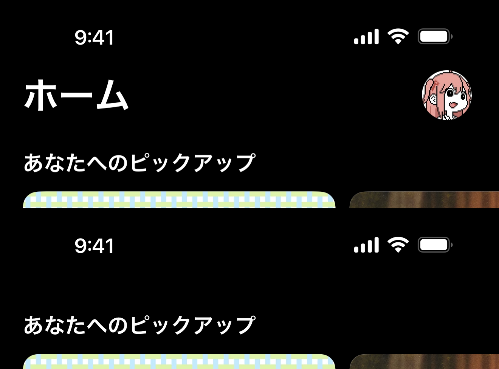

iOS 26 の Apple Music では、スクロールすると大きなナビゲーションタイトルとツールバーの内容が見えなくなる。iOS 11 以降の一般的な large title の動きとは少し違う。



従来の遷移は次のようなものだった。

```plain
Large Title
   ↓ scroll
Small Navigation Title
```

Apple Music の表示は、こちらに近い。

```plain
Large Title
   ↓ scroll
(no title)
```

この挙動をそのまま有効にする SwiftUI の公開 modifier は、今のところ用意されていない。再現方法は、スクロール位置から独自の header を制御する方法と、compact title だけを空にする簡単な方法に分けられる。

## header 全体を制御する

きちんと作るなら、必要になるのはだいたい次の要素だ。

- `safeAreaInset(edge: .top)` に配置する独自 header
- `ScrollGeometry` を使ったスクロール位置の検出
- タイトルとほかの toolbar item を分けた表示制御
- opacity や offset のアニメーション

SwiftUI 側の部品はすでに揃っている。

```swift
.onScrollGeometryChange(...)
.safeAreaInset(...)
.toolbar(...)
```

ただし、専用のナビゲーションバー設定ではなく、あくまで低レベルな部品だ。単純な例なら、縦方向の offset が一定値を超えたところで header を隠せばよい。

```swift
struct CollapsingHeaderView: View {

    @State private var headerHidden = false

    var body: some View {
        ScrollView {
            VStack {
                ForEach(0..<50) { i in
                    Text("Row \(i)")
                        .frame(maxWidth: .infinity)
                        .padding()
                }
            }
        }
        .onScrollGeometryChange(for: CGFloat.self) { geometry in
            geometry.contentOffset.y
        } action: { _, offset in
            headerHidden = offset > 40
        }
        .safeAreaInset(edge: .top) {
            header
                .opacity(headerHidden ? 0 : 1)
                .animation(.easeInOut, value: headerHidden)
        }
    }

    private var header: some View {
        HStack {
            Text("Library")
                .font(.largeTitle.bold())

            Spacer()

            Image(systemName: "person.crop.circle")
        }
        .padding()
        .background(.ultraThinMaterial)
    }
}
```

`ScrollView`、`List`、`LazyVStack` のどれを使う場合でも応用でき、header のレイアウトや隠すタイミング、アニメーションも自由に決められる。

一方で、スクロール方向、しきい値、ツールバーの配置、refreshable との組み合わせ、入れ子になった `NavigationStack` の edge case まで、アプリ側で面倒を見ることになる。画面全体の挙動を正確に合わせたいなら妥当だが、compact title を消したいだけなら少し大げさだ。

## compact title だけなら principal を空にする

もっと簡単な方法は、principal の toolbar item に空のタイトルを置くことだ。

```swift
.toolbar {
    ToolbarItem(placement: .principal) {
        Text("")
    }
}
```

通常の large title はそのまま設定する。

```swift
.navigationTitle("Library")
.navigationBarTitleDisplayMode(.large)
```

すると、見た目の遷移は次のようになる。

```plain
Large Title
   ↓ scroll
(empty)
```

リスト上部では大きなタイトルが表示され、折りたたまれた後は principal item の空文字列が compact title になる。

```swift
NavigationStack {
    List(items) { item in
        Text(item.title)
    }
    .navigationTitle("Library")
    .navigationBarTitleDisplayMode(.large)
    .toolbar {
        ToolbarItem(placement: .principal) {
            Text("")
        }
    }
}
```

スクロール状態を追加しなくても、標準の `NavigationStack` だけで Apple Music にかなり近い見た目になる。

## 実際に消えているのはタイトルの内容だけ

SwiftUI のナビゲーションタイトルは、通常この 2 つの状態を行き来する。

```plain
Large Navigation Title
        ↓
Compact Navigation Title
```

principal toolbar item は compact 側に表示される内容を置き換える。そこを空にすると、

```plain
Large Title
   ↓
Small Title
```

だったものが、

```plain
Large Title
   ↓
(blank space)
```

になる。

ナビゲーションバー自体が削除されたわけではない。compact title の中身が何も描画されないため、header が消えたように見えている。

この違いから、制約もはっきりしている。

- ナビゲーションバーは残っている
- ほかの toolbar item は引き続きスペースを使う場合がある
- 現在の SwiftUI の描画挙動に依存するため、将来のバージョンで変わる可能性がある

header とそのレイアウト全体を消す必要があるなら、スクロール位置を使う実装を選ぶ。compact title が空になれば十分なら、principal item の方法で済ませるのが軽い。

## 将来は公式 API になるかもしれない

Apple は、システムアプリで先に UI を導入し、その後に関連する公開 API を提供することがある。`.searchable`、large navigation title、Apple Music で使われているタブバーの最小化も、その流れで登場した例だ。

将来の SwiftUI に、たとえば次のような API が追加される可能性はある。

```swift
.navigationBarCollapseBehavior(.onScroll)
```

あるいは、

```swift
.toolbarScrollVisibility(.hidden)
```

もちろん、この 2 つは API の形を説明するための例であり、現時点では存在しない。
